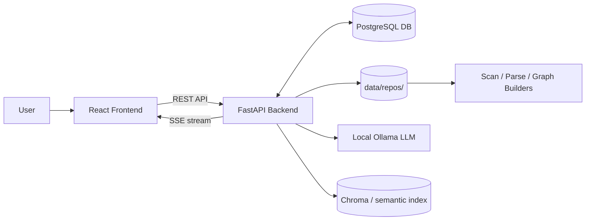

# Architecture and Progress

## Purpose

Repository Intelligence Platform is a repository analysis MVP. It imports a GitHub repository, stores it locally, scans source files, and presents structural and semantic views through a web UI.

## High-Level Architecture

## Implemented Components

### Backend

- `backend/main.py` hosts the FastAPI application and background worker queue.
- Repository import validates GitHub URLs, clones repos into `data/repos/`, and records metadata in PostgreSQL.
- Repository listing, artifact storage, and task tracking are backed by PostgreSQL and SQLAlchemy models.
- Repository metadata is extracted deterministically in a modular pipeline (`RepositoryMetadataStage`) that captures frameworks, entrypoints, and architectural layers.
- Python parsing extracts imports, functions, classes, and docstrings from individual files.
- Dependency and call-graph endpoints derive relationships from the parsed Python source.
- `backend/llm_service.py` sends deterministic repository metadata to a local Ollama instance for high-quality summary generation.
- Real-time updates for long-running analysis tasks are pushed to the frontend instantly using an in-memory pub/sub `TaskManager` and Server-Sent Events (SSE).

### Frontend

- `frontend/src/App.jsx` provides the top-level router and layout.
- `Dashboard` lists imported repositories and supports deletion.
- `ImportRepository` handles importing a new GitHub repository.
- `RepositoryDetails` hosts the analysis workspace for a selected repository.
- The repository detail screen includes file explorer, dependency graph, architecture, call graph, search, semantic search, symbol explorer, and summary tabs.
- `useTaskStatus` React hook connects to the backend's SSE stream to provide zero-latency loading states without repetitive polling.

### Storage and State

- PostgreSQL tracks `User`, `Repository`, `AnalysisJob`, `AnalysisArtifact`, and `TaskStatus`.
- `data/repos/` stores cloned repository source files.
- ChromaDB is used for the local semantic index.

## Current Progress

- Core import and browse workflow is robust and DB-backed.
- Basic Python source analysis works end to end.
- UI navigation for repository exploration is wired up.
- LLM-backed summary generation is connected to a local Ollama service, using strict deterministic metadata to avoid hallucinations.
- The project has a solid, non-blocking real-time background task architecture.

## Known Gaps / Next Work

- Broaden analysis beyond Python-specific parsing where needed.
- Add automated tests for backend endpoints and the main UI flows.
- Document any semantic indexing or visualization pipeline details as those features stabilize.

## Status Snapshot

This document reflects the implementation state as of July 2026.