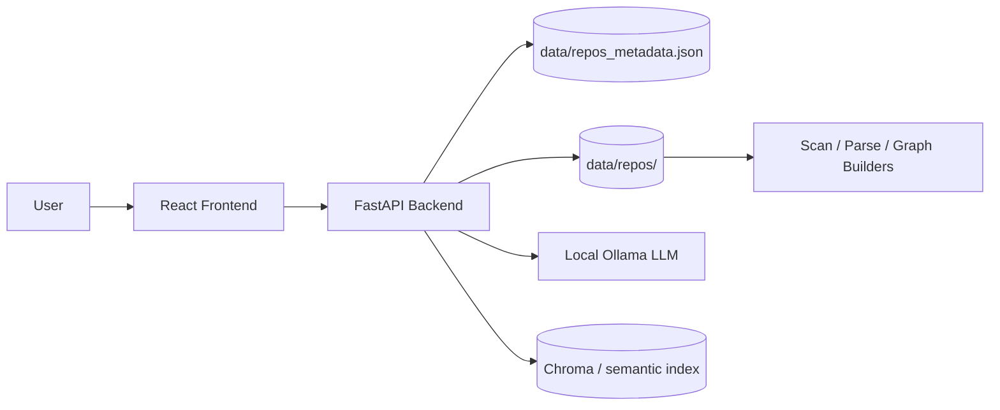

# Architecture and Progress

## Purpose

Repository Intelligence Platform is a repository analysis MVP. It imports a GitHub repository, stores it locally, scans source files, and presents structural and semantic views through a web UI.

## High-Level Architecture

## Implemented Components

### Backend

- `backend/main.py` hosts the FastAPI application.
- Repository import validates GitHub URLs, clones repos into `data/repos/`, and records metadata.
- Repository listing and deletion are backed by `data/repos_metadata.json` and the local clone directory.
- Repository scanning builds a deterministic file hierarchy and basic file metadata.
- Python parsing extracts imports, functions, classes, and docstrings from individual files.
- Dependency and call-graph endpoints derive relationships from the parsed Python source.
- `backend/llm_service.py` sends repository metadata to a local Ollama instance for summary generation.

### Frontend

- `frontend/src/App.jsx` provides the top-level router and layout.
- `Dashboard` lists imported repositories and supports deletion.
- `ImportRepository` handles importing a new GitHub repository.
- `RepositoryDetails` hosts the analysis workspace for a selected repository.
- The repository detail screen already includes file explorer, dependency graph, architecture, call graph, search, semantic search, symbol explorer, and summary tabs.

### Storage and State

- `data/repos_metadata.json` stores imported repository metadata.
- `data/repos/` stores cloned repositories.
- Repository analysis artifacts and semantic indexes are stored per repository under `data/repos/<repo>/`.

## Current Progress

- Core import and browse workflow is in place.
- Basic Python source analysis works end to end.
- UI navigation for repository exploration is wired up.
- LLM-backed summary generation is connected to a local Ollama service.
- The project now has a working base for expanding semantic search, architecture visualization, and deeper code intelligence features.

## Known Gaps / Next Work

- Broaden analysis beyond Python-specific parsing where needed.
- Harden error handling around repository import and parsing.
- Add automated tests for backend endpoints and the main UI flows.
- Document any semantic indexing or visualization pipeline details as those features stabilize.

## Status Snapshot

This document reflects the implementation state as of 2026-07-05.