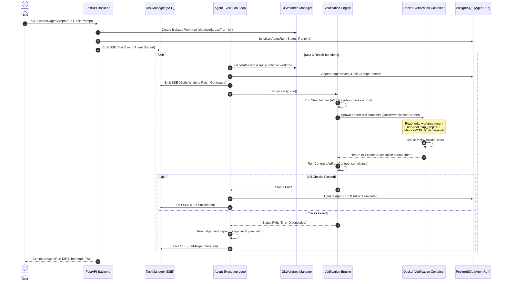

# System Architecture & Technical Specifications

This document describes the **active implementation architecture** of the Repository Intelligence Platform (GitOnboard), including comprehensive High-Level Design (HLD) and Low-Level Design (LLD) for essential subsystems.

---

## 1. High-Level Design (HLD)

GitOnboard operates as an end-to-end repository-aware intelligence and automated developer assistance platform. It deterministically parses codebases, constructs semantic and relational graphs, persists structured facts in PostgreSQL, indexes symbols into vector and lexical stores, and provides interactive AI assistance (tracing, chat, summary, IDE agent execution, and verification).

### System Topology

```mermaid
flowchart TD
    User([Developer / Browser])
    
    subgraph Frontend ["Frontend (Next.js 16 App Router + React 19 + ReactFlow)"]
        UI[Dashboard / Explorer / Repo Views]
        ChatUI[Interactive Repo Chatbot]
        TraceUI[Feature Tracer Canvas]
        IDE_Terminal[Web Terminal / Sandbox Shell]
        SSE_Client[useTaskStatus / EventSource Client]
    end
    
    subgraph Backend ["Backend Gateway & Application Core (FastAPI)"]
        API[FastAPI Routers & Middleware]
        Queue[InMemoryQueue / Task Dispatcher]
        Worker[AnalysisWorker]
        TM[TaskManager Pub/Sub SSE]
        LLM[Multi-Provider LLM Gateway]
    end
    
    subgraph Intelligence ["Intelligence & Retrieval Engine (backend/intelligence/)"]
        Scanner[RepositoryScanner]
        TreeSitter[Tree-sitter Multi-Language AST Parsers]
        RIM[Repository Intelligence Model Graph]
        CapEngine[Layer 6 Capability Detection]
        FeatEngine[Feature Clustering Engine]
        HybridRetriever[Hybrid Retrieval Engine]
        BM25[BM25 Lexical Index + CodeTokenizer]
    end

    subgraph SandboxedAgent ["AI IDE Agent & Sandboxed Verification (backend/verification/)"]
        WorktreeMgr[Git Worktree Isolation]
        AgentLoop[Agent 3-Pass Repair Loop]
        DockerSandbox[Docker Verification Container Sandbox]
    end
    
    subgraph Persistence ["Persistence Layer"]
        PG[(PostgreSQL Database)]
        FactStore[(Layer 4 Fact Store Tables)]
        Chroma[(ChromaDB Vector Store)]
        AzuriteBlob[(Azurite / Azure Blob Storage)]
    end
    
    User <--> UI
    User <--> ChatUI
    User <--> TraceUI
    User <--> IDE_Terminal

    UI -- REST API --> API
    ChatUI -- REST / Stream --> API
    TraceUI -- REST --> API
    IDE_Terminal <-- WebSocket --> API
    SSE_Client <-- SSE Stream (`/tasks/stream`, `/agent/stream`) -- TM
    
    API --> Queue
    Queue --> Worker
    Worker --> Scanner --> TreeSitter --> RIM --> CapEngine --> FeatEngine
    Worker -- Persists Facts --> FactStore
    Worker -- Saves Snapshots & Artifacts --> AzuriteBlob
    Worker -- Emits Progress --> TM
    Worker -- Embeds Chunks --> Chroma
    
    API --> HybridRetriever
    HybridRetriever --> BM25
    HybridRetriever --> Chroma
    HybridRetriever --> FactStore
    
    API --> SandboxedAgent
    SandboxedAgent --> WorktreeMgr
    SandboxedAgent --> DockerSandbox
    
    API --> LLM
    FactStore --> PG
```

---

## 2. Ingestion & Analysis Pipeline Flow

When a repository is imported via `POST /api/import` or reanalyzed via `POST /api/repos/{repo_name}/reanalyze`:

```text
Repository URL
      │
      ▼
1. Pre-flight & Download (GitHub API / Zipball download to /tmp)
      │
      ▼
2. Scanning & Language Detection (RepositoryScanner & Framework detection)
      │
      ▼
3. Multi-Language Tree-sitter Parsing (CST/AST generation for Python, TS/JS, Java, Go, C/C++, Ruby)
      │
      ▼
4. RIM Graph Construction (Directed Entity-Relationship Call/Import Graph)
      │
      ▼
5. Layer 6 Capability Detection (Auth, CRUD, Background workers, DB ORM)
      │
      ▼
6. Feature Reconstruction (Entrypoint -> Service -> DB Clustering)
      │
      ▼
7. Layer 4 Relational Fact Store (PostgreSQL persistence with composite keys {analysis_id}:{entity_id})
      │
      ▼
8. Vector & Lexical Embeddings (ChromaDB + In-memory BM25 index pre-caching)
      │
      ▼
9. Analysis Artifact Storage (Compressed Core Model, Metrics JSON to Blob Store)
```

---

## 3. Low-Level Design (LLD): Essential Subsystems

### 3.1. Hybrid Retrieval Engine (`backend/intelligence/retrieval/`)

The retrieval system uses a **tri-channel hybrid architecture** with **Reciprocal Rank Fusion (RRF)** and **deterministic Fact Store expansion** to eliminate keyword blindness and hallucination.

```text
                                User Query
                                    │
         ┌──────────────────────────┼──────────────────────────┐
         ▼                          ▼                          ▼
1. Fact Store Direct       2. BM25 Lexical            3. Dense Semantic
   Exact Lookup               CodeTokenizer              ChromaDB HNSW
   - Exact symbol names       - CamelCase/snake_case     - Conceptual intent
   - Exact route paths        - Identifier subwords      - Vector embeddings
   - Exact table names        - Inverted index           - Top-30 distance
   (Weight = 1.2)             (Weight = 1.0)             (Weight = 1.0)
         │                          │                          │
         └──────────────────────────┼──────────────────────────┘
                                    ▼
                 4. Reciprocal Rank Fusion (RRF)
                    Score(d) = sum( w_m / (k_rrf + rank(d, m)) )
                                    ▼
                 5. Fact Store Structural Expansion
                    - Top seed entities query PostgreSQL
                    - Pull immediate Callers & Callees (limit: 2/seed)
                    - Attach HTTP routes & Capability memberships
                    - Hard bounded to top_k <= 25 context nodes
                                    ▼
                        Final Unified Context
```

#### Key Components:
- **`CodeTokenizer`** ([`backend/intelligence/retrieval/lexical.py`](file:///f:/GitOnboard/backend/intelligence/retrieval/lexical.py)): Custom code-aware regex tokenizer that preserves identifiers and splits `camelCase`, `snake_case`, `PascalCase`, and URL routes into subwords without corrupting stemming.
- **`BM25Index`** ([`backend/intelligence/retrieval/lexical.py`](file:///f:/GitOnboard/backend/intelligence/retrieval/lexical.py)): Fast, in-memory Okapi BM25 implementation ($k_1=1.5, b=0.75$) with smoothed Inverse Document Frequency (IDF).
- **`reciprocal_rank_fusion`** ([`backend/intelligence/retrieval/fusion.py`](file:///f:/GitOnboard/backend/intelligence/retrieval/fusion.py)): Fuses disparate ranking distributions safely without score normalization skew.
- **`FactStoreExpander`** ([`backend/intelligence/retrieval/expansion.py`](file:///f:/GitOnboard/backend/intelligence/retrieval/expansion.py)): Queries relational `relationships`, `routes`, and `capability_members` tables in PostgreSQL to furnish complete operational context for the LLM.

---

### 3.2. Feature Tracing & Execution Flow Engine (`backend/intelligence/feature_tracing.py`)

Deterministic execution flow reconstructor that tracks how an HTTP route or business capability travels through backend layers.

#### Flow Construction Algorithm:
1. **Seed Discovery**: Uses `HybridRetriever` to resolve the starting entrypoint entity from user query text.
2. **Graph Expansion**: Traverses `DEPENDS_ON` and `CALLS` edges in the RIM model up to depth 2.
3. **Import Resolution**: Connects active nodes with source-to-target module import edges.
4. **Layer-Based Topological Ordering**: Assigns architectural weights to nodes:
   - *Layer 1*: Routes, Routers, API Endpoints (`/api/...`)
   - *Layer 2*: Controllers / Request Handlers
   - *Layer 3*: Services / Business Logic Managers
   - *Layer 4*: Repositories / Data Access Objects (DAOs)
   - *Layer 5*: Database Models, Tables, and Entities
   - *Layer 6*: Serializers, DTOs, and HTTP Responses
5. **Output**: Generates a linear step-by-step execution path visualized as node cards and dependency arrows in the Next.js ReactFlow canvas.

---

### 3.3. Multi-Provider LLM & Chatbot Service (`backend/llm_service.py`)

The platform's synthesis layer powers interactive repository onboarding, explanation, and architectural Q&A.

```text
User Question / Chat Prompt
             │
             ▼
┌───────────────────────────────┐
│ Context Assembler             │
│ - HybridRetriever context     │
│ - Fact Store signatures       │
│ - Enriched Repository Profile │
└──────────────┬────────────────┘
               │
               ▼
┌────────────────────────────────────────────────────────┐
│ LLM Provider Dispatcher (backend/llm_service.py)       │
│                                                        │
│ 1. Local Ollama (`OLLAMA_BASE_URL`, default: 11434)    │
│    Model: qwen2.5-coder:7b / llama3.2                  │
│                      │ (if offline / fails)            │
│                      ▼                                 │
│ 2. Gemini / OpenRouter API (`GEMINI_API_KEY`)          │
│                      │ (if keys not present)           │
│                      ▼                                 │
│ 3. Deterministic Fact-Based Synthesizer (Fallback)     │
└──────────────────────┬─────────────────────────────────┘
                       │
                       ▼
              Streaming / JSON Response
```

#### Core Prompting Invariant:
All prompts enforce strict zero-hallucination ground rules:
- Answers must be constructed *strictly* from retrieved Fact Store symbols, file paths, and RIM relationships.
- Placeholder text (`[Language]`, `[Framework]`) and generic assumptions are strictly forbidden.

---

### 3.4. AI Implementation Agent & Sandboxed Verification (`backend/verification/`)

The platform features an autonomous coding and repair engine designed to safely write, verify, and repair code without compromising host stability.



#### Security & Isolation Guarantees:
- **Worktree Isolation**: Host filesystem is untouched; changes occur in disposable Git worktrees (`data/worktrees/`).
- **Container Sandboxing**: Dynamic test and code executions run in locked-down containers (`no-new-privileges`, `cap_drop: ALL`, unprivileged user).
- **Docker-Outside-of-Docker Path Mapping**: Backend container automatically translates internal paths to host paths (`HOST_DATA_DIR`) before requesting volume mounts from the host Docker daemon.

---

### 3.5. Web Terminal & Interactive Sandbox (`backend/routers/repo/sandbox.py`)

Provides developers with real-time interactive browser terminals to inspect repositories and test environments directly from the web UI.

- **WebSocket Tunneling**: Connects Next.js XTerm.js terminal (`frontend/components/Terminal.tsx`) to backend WebSocket endpoints (`/api/v1/sandbox/{repo_name}/terminal`).
- **PTY Session Spawning**: 
  - On Linux/macOS: Utilizes POSIX `pty.openpty()` / `os.fork()`.
  - On Windows: Uses `pywinpty` for native Windows ConPTY emulation.
- **Bi-directional Streaming**: Asynchronously pipes terminal resize events, keystrokes, and raw ANSI output.

---

## 4. Component Classification

| Status | Components | Directory / Modules |
|---|---|---|
| **ACTIVE** | Multi-Language Tree-sitter Parser Engine | `backend/intelligence/engine/` |
| **ACTIVE** | Repository Intelligence Model (RIM) Graph | `backend/intelligence/rim/` |
| **ACTIVE** | Relational Layer 4 Fact Store & ORM | `backend/intelligence/store/fact_store.py`, `backend/models/fact_store.py` |
| **ACTIVE** | Layer 6 Capability Detection Engine | `backend/intelligence/capabilities/` |
| **ACTIVE** | Feature Reconstruction & Tracing | `backend/intelligence/features/`, `backend/routers/repo/trace.py` |
| **ACTIVE** | Hybrid Retrieval (BM25 + Chroma + Fact Store) | `backend/intelligence/retrieval/`, `backend/routers/repo/semantic.py` |
| **ACTIVE** | Multi-Provider LLM & Synthesis Service | `backend/llm_service.py` |
| **ACTIVE** | AI Implementation Agent & Sandboxed Verification | `backend/verification/`, `backend/services/` |
| **ACTIVE** | Interactive Web PTY Terminal Sandbox | `backend/routers/repo/sandbox.py` |
| **ACTIVE** | Next.js 16 App Router UI & ReactFlow Canvas | `frontend/app/`, `frontend/components/` |
| **PLANNED** | Automated Pull Request Export Automation | Target specifications in `docs/contracts/agent.md` |
| **LEGACY** | Deprecated / Orphaned Code | `archive/legacy/` (Read-only reference) |

---

## 5. Team Ownership Boundaries

| Role | Directory Ownership | Primary Responsibilities |
|---|---|---|
| **Frontend Teammate** | `frontend/` | Next.js 16 App Router, React 19 UI, ReactFlow interactive canvases, XTerm.js terminal client, SSE task hooks, Tailwind CSS design system. |
| **Backend / API Teammate** | `backend/` (core app) | FastAPI routers (`auth.py`, `health.py`, `repo/core.py`, `repo/tasks.py`), database configuration, SQLAlchemy models (`user.py`, `repository.py`), queue workers, SSE streaming. |
| **Intelligence / AI Teammate (You)** | `backend/intelligence/`, `backend/verification/`, `backend/models/fact_store.py`, `backend/llm_service.py`, `backend/routers/repo/` | Tree-sitter AST parsing, RIM graph model, Layer 4 Fact Store, Layer 6 capability detection, feature tracing, Hybrid Retrieval, Sandboxed Verification engine, LLM synthesis. |
